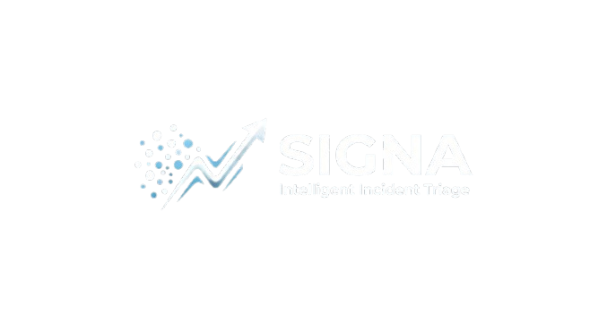

# SIGNA📡

<div align="center">



</div>

---

## Misión

SIGNA transforma las comunicaciones desestructuradas de clientes en señales operativas claras, priorizadas y accionables, combinando inteligencia artificial con supervisión humana.

---

## Filosofía

```text
NOISE
  │
  ▼
┌──────────┐
│  SIGNA   │
└──────────┘
  │
  ├── Understand
  ├── Prioritize
  ├── Route
  └── Explain
  │
  ▼
SIGNAL
  │
  ▼
HUMAN
  │
  ▼
ACTION
```

---

## Ecosistema SIGNA

- **SIGNA Core** → motor de triaje.
- **SIGNA Local** → modelo Ollama.
- **SIGNA Cloud** → modelo comercial.
- **SIGNA Review** → interfaz Human-in-the-loop.
- **SIGNA Metrics** → métricas y benchmarking.
- **SIGNA Lab** → comparación de modelos.
